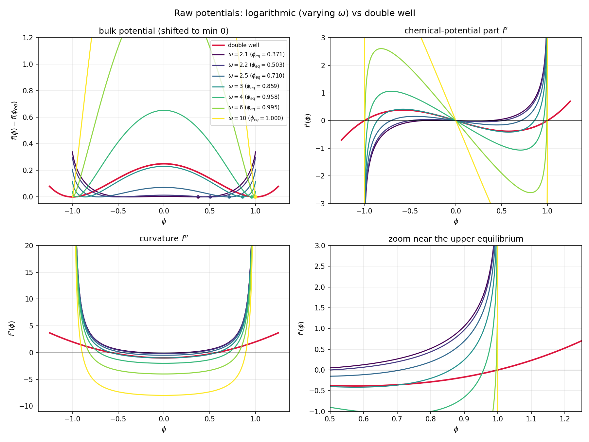
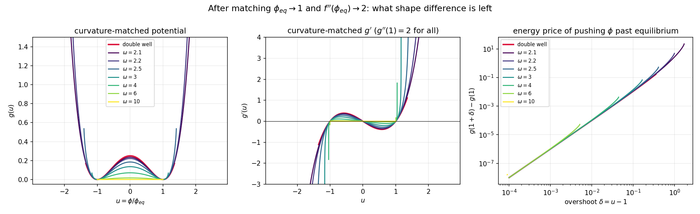
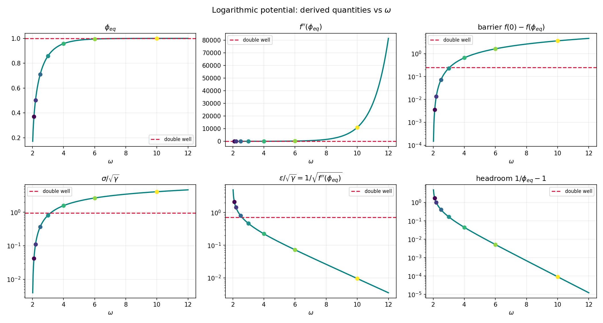

# Potential shapes: derived quantities

Generated by `py/plot_potentials.py`. Energy functional $F=\int f(\phi)+\tfrac{\gamma}{2}|\nabla\phi|^2$.

* `phi_eq` — positive root of $f'$;
* `f''(phi_eq)` — curvature at equilibrium; sets the Gibbs-Thomson shift $\delta\phi=\mu/f''(\phi_{eq})$;
* `sigma/sqrt(gamma)` — $\int_{-\phi_{eq}}^{\phi_{eq}}\sqrt{2\Delta f}\,d\phi$;
* `eps/sqrt(gamma)` — interface decay length $1/\sqrt{f''(\phi_{eq})}$;
* `gamma for eps=1` — the $\gamma$ that gives a unit interface length, i.e. $f''(\phi_{eq})$; use it to compare potentials at *matched* interface width;
* `sigma at eps=1` — resulting surface tension at that matched width;
* `headroom` — $1/\phi_{eq}-1$, the relative overshoot available before $f=+\infty$;
* `Lambda` — $\sigma/(\phi_{eq} f''(\phi_{eq})\epsilon)$, a pure shape number: the 3D Gibbs-Thomson overshoot is $\delta\phi/\phi_{eq}=2\Lambda\,\epsilon/R$, independent of $\gamma$. Smaller is better.

| potential | phi_eq | f''(phi_eq) | barrier | sigma/sqrt(gamma) | eps/sqrt(gamma) | gamma for eps=1 | sigma at eps=1 | headroom | Lambda |
|---|---|---|---|---|---|---|---|---|---|
| double well | 1.0000 | 2.0000 | 0.2500 | 0.9428 | 0.7071 | 2.0000 | 1.3333 | inf | 0.6667 |
| log, omega=2.1 | 0.3707 | 0.2186 | 0.0035 | 0.0418 | 2.1387 | 0.2186 | 0.0196 | 1.6976 | 0.2412 |
| log, omega=2.2 | 0.5029 | 0.4772 | 0.0134 | 0.1110 | 1.4476 | 0.4772 | 0.0766 | 0.9883 | 0.3194 |
| log, omega=2.5 | 0.7104 | 1.5378 | 0.0717 | 0.3684 | 0.8064 | 1.5378 | 0.4569 | 0.4076 | 0.4182 |
| log, omega=3 | 0.8586 | 4.6082 | 0.2304 | 0.8154 | 0.4658 | 4.6082 | 1.7503 | 0.1647 | 0.4424 |
| log, omega=4 | 0.9575 | 20.0425 | 0.6530 | 1.5798 | 0.2234 | 20.0425 | 7.0726 | 0.0444 | 0.3685 |
| log, omega=6 | 0.9949 | 190.6385 | 1.6187 | 2.6778 | 0.0724 | 190.6385 | 36.9724 | 0.0051 | 0.1949 |
| log, omega=10 | 0.9999 | 10994.2288 | 3.6138 | 4.1265 | 0.0095 | 10994.2288 | 432.6761 | 0.0001 | 0.0394 |

